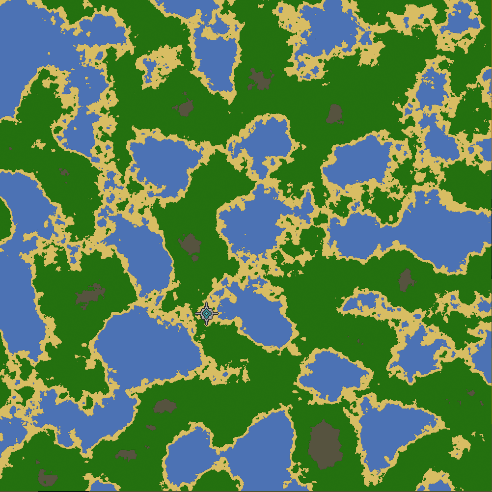

# TEXHEC
## What is TEXHEC ?

### Answer for interested players

TEXHEC is a game during development.

In TEXHEC we can win by:
- technological win
- total enemies anihilation

Point of the game is to allow complex tactics (all moves allowed) in seamingly endless world.

Everything can be either done automaticaly or manualy.
Everything is under player control where he has to find order in endless chaos and has to conquer it before others do so.

### Technical answer

TEXHEC is a vision **RTS** (real time strategy) game which currently is being brought to life.\
On current stage of TEHXEC i wrote **dozens** of **unique** **modules** from every solved other problems.\
Its completely build from scratch with **less** **than** a **dozen** of **dependencies** not controled by me.

TEXHEC is a **HIGH-Performance** project where natural map size is **1.000.000*** tiles with hundreds or thousands buildings and units **all** being **simulated** in real time.\
We use **DOD** and use our **own** **ECS** framework.

[More about this **ECS** framework](./engine/services/ecs/readme/README.md)

#### Why golang
Others would **discard golang** due to **garbage collector**.\
In reality garbage collector isn't an inconvenience because we follow **DOD** and\
we do not have enough pointers to be an inconvenience.

In reality using golang has benefits:
- its very performant (its compiled)
- its fast to write, understand and its very easy to use (necessary to deliver by a single developer)
- it lacks decades of building technical debt
- aligned philosophies (simplicity creates performance not other way around)

#### Dependencies
- `sdl2`
- `opengl`
- `opengl math`
- `golang constraints`
- `golang images and text (used only to generate image per letter)`
- `thread safe hash map`
- `google uuid`

Dependencies which are written by me:
- `ioc`
- `events`

#### Module vs Service
Service is something separate from game engine which is basis for it.\
After creating **ECS** service i attempt to migrate everything to a module.\
Modules also have more struct rules and have dedicated file structure.\
Services are more detached from alone game engine and have less strict rules.

#### Module structure
```
modules/
└─ `$module_name`/
    ├── internal/       # Defines implementation for `Serivce` and `System` (if exist in module)
    ├── pkg/            # This exposes `Package` function to register `Service` implementation.
    │                   # `pkg`, `internal` and `tests` separation allows `modules`
    │                   # Decouples the interface definition from the construction logic to allow for flexible dependency wiring
    ├── tests/          # Defines tests
    ├── readme/         # Defines readme
    └── `$interface.go` # There is no strict file rule naming. This defines what module exposes
                        # Expects interface name `Service` so module name and service purpose were related
```
Everything in module file structure is optional and should be only added if used.

#### Engine
Engine is the core which can be re-used in other projects.\
It defines ecs framework and basic engine modules like `transform` or `hierarchy`

Cherry picked readmes to show project complexity:
- [ecs](./engine/services/ecs/readme/README.md)
- [assets](./engine/modules/assets/readme/README.md)
- [hierarchy](./engine/modules/hierarchy/readme/README.md)
- [record](./engine/modules/record/readme/README.md)
- [transform](./engine/modules/transform/readme/README.md)

Engine modules:
- [assets](./engine/modules/assets/readme/README.md)
- [audio](./engine/modules/audio/readme/README.md)
- [batcher](./engine/modules/batcher/readme/README.md)
- [camera](./engine/modules/camera/readme/README.md)
- [collider](./engine/modules/collider/readme/README.md)
- [connection](./engine/modules/connection/readme/README.md)
- [drag](./engine/modules/drag/readme/README.md)
- [grid](./engine/modules/grid/readme/README.md)
- [groups](./engine/modules/groups/readme/README.md)
- [hierarchy](./engine/modules/hierarchy/readme/README.md)
- [inputs](./engine/modules/inputs/readme/README.md)
- [layout](./engine/modules/layout/readme/README.md)
- [netsync](./engine/modules/netsync/readme/README.md)
- [noise](./engine/modules/noise/readme/README.md)
- [record](./engine/modules/record/readme/README.md)
- [registry](./engine/modules/registry/readme/README.md)
- [relation](./engine/modules/relation/readme/README.md)
- [render](./engine/modules/render/readme/README.md)
- [scene](./engine/modules/scene/readme/README.md)
- [seed](./engine/modules/seed/readme/README.md)
- [smooth](./engine/modules/smooth/readme/README.md)
- [text](./engine/modules/text/readme/README.md)
- [transform](./engine/modules/transform/readme/README.md)
- [transition](./engine/modules/transition/readme/README.md)
- [uuid](./engine/modules/uuid/readme/README.md)

Engine services:
- [clock](./engine/services/clock/readme/README.md)
- [codec](./engine/services/codec/readme/README.md)
- [console](./engine/services/console/readme/README.md)
- [datastructures](./engine/services/datastructures/readme/README.md)
- [ecs](./engine/services/ecs/readme/README.md)
- [frames](./engine/services/frames/readme/README.md)
- [graphics](./engine/services/graphics/readme/README.md)
- [httperrors](./engine/services/httperrors/readme/README.md)
- [logger](./engine/services/logger/readme/README.md)
- [media](./engine/services/media/readme/README.md)
- [runtime](./engine/services/runtime/readme/README.md)

#### Technical challanges
Each and every module had unique challanges and they are described in these readmes.

Biggest challange of the whole project was architecture.\
Finding file structure which allows for most logic with least friction between modules.\
Current approach reduces whole friction to a few interface files and often in a single `Service` interface.

### Graphics

Example map generated in a matter of seconds and rendered in less than 6ms\
using 5 years old Intel® Core™ i5-8350U × 8 Intel® UHD Graphics 620 (KBL GT2):



## How to run ?
### Install dependencies
Install packages for:
- opengl
- sdl2

ubuntu:
```
sudo apt install libsdl2-dev libsdl2-image-dev libsdl2-ttf-dev libsdl2-mixer-dev
sudo apt install mesa-common-dev libglew-dev libglu1-mesa-dev
```

arch:
```
sudo pacman -S sdl2 mesa libglew glue
sudo pacman -S sdl2_image sdl2_mixer sdl2_ttf
```

### Run
```
cd core
go run .
```

## License

Internal/Private.
Currently this repo is public to allow to see code and what it does for recruitment
